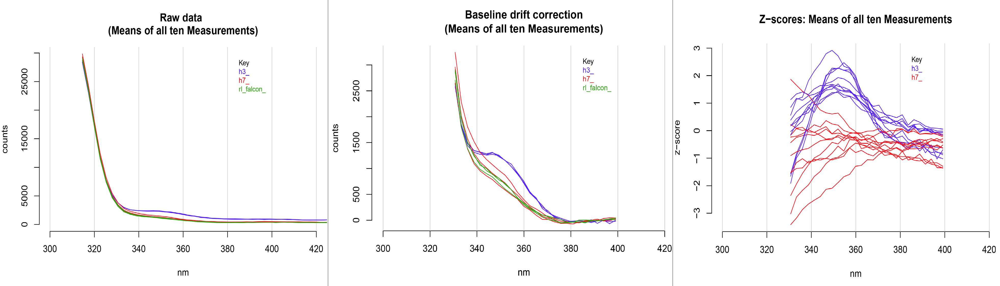

# My cloud-deployed App: ML prediction of bio-contamination from UV-spectra
The Shiny App for bio-contamination prediction of user-provided spectra samples was created during my stay in 
[Prof. Rainer König lab](https://www.uniklinikum-jena.de/infektionsmedizin/Forschung/Modelling.html) as part of the project on 
construction a germ detection device employing UV LEDs. It is deployed at the free-of-charge Shiny server:
https://spectra-app.shinyapps.io/shiny_app__our_uv_device/

Machine Learning (ML) algorithms were implemented on a preliminary dataset of experimentally obtained spectra at 270 nm excitation 
and 314–883 nm emissions (different ranges of emissions were tested and the range 330-400 nm was selected as a default setting in 
the workflow) using R packages ‘caret’ (ver. 6.0-90) or ‘h2o’ (ver. 3.32.0.5). The best predicting model (GLMnet logistic 
regression, AUC metric) was selected and uploaded to the server. It is the central element of the App and designated as 
'best_Machine.RData' in the repository.

The input functionality of the App includes selection and uploading of user’s multiple csv-files of samples for evaluation, blanks 
and calibrators for z-score transformation (positive and negative controls). The button “Analyse” activates the algorithm 
with the outcome of a table of probabilities and class predictions. Also, for demonstration purposes, there is an option to run 
the App in a “Demo mode” with preloaded dummy files. 

## Spectra preprocessing

After initial data formatting, the spectra preprocessing is realized with R package ‘ChemoSpec’ (ver. 6.1.0). The data, ten repeated 
spectra measurements per sample, is loaded from each csv-files and converted to spectra objects using the "matrix2SpectraObject()" 
function. Next, the following normalizations are carried out:

&nbsp;&nbsp;&nbsp;1) Baseline drift correction (‘baselineSpectra()’ function, method ‘rfbaseline()’): compensation of uneven 
amplitude shifts across different wavelengths;

&nbsp;&nbsp;&nbsp;2) Blank subtraction: blanks (samples of saline solution without bacteria) are averaged, and the result is 
subtracted from each experimental sample (per wavelength) to reduce the effects of systematic errors;

&nbsp;&nbsp;&nbsp;3) In order to make the analysed spectra comparable with ones used during model training, the standard score 
(z-score) transformation (centering and variance-scaling) of each experimental sample is performed by subtracting calibrators' mean 
intensities from each intensity value of the experimental samples and then dividing the difference by the calibrators' standard 
deviation.

An example of the above-mentioned preprocessing steps of experimental samples is shown in the figure below. Each line represents one 
sample, mean of ten repeated measurements: ‘h3’ denotes positive controls (“high” bio-contaminated samples), ‘h7’ denotes negative 
controls (very diluted, “low” bio-contaminated samples), ‘rl_falcon’ denotes blanks.

